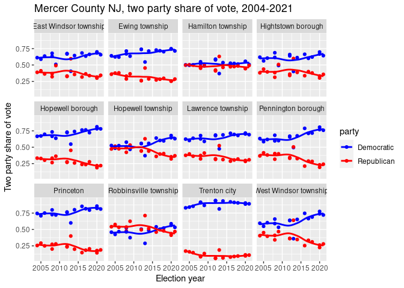

<!-- README.md is generated from README.Rmd. Please edit that file -->

# njelections

<!-- badges: start -->
<!-- badges: end -->

This is a data package for R containing the results of statewide
elections in NJ, from 2004 to 2021.

## Installation

You can install the development version of `njelections` like so:

``` r
# install.packages("devtools")
devtools::install_github("tor-gu/njelections")
```

## Dataset Overview

This package contains the results of statewide general elections for
three offices:

-   New Jersey Governor
-   US Senate
-   US President

All elections from 2004 to 2021 are included, at three levels of
organization:

-   Statewide (`election_statewide`)
-   By county (`election_by_county`)
-   By municipality (`election_by_municipality`)

#### Table `election_statewide`

Table `election_statewide` contains the following columns, which are
common to all tables in this dataset:
<table class="kable">
<thead>
<tr>
<th style="text-align:left;">
Field
</th>
<th style="text-align:left;">
Type
</th>
<th style="text-align:left;">
Description
</th>
<th style="text-align:left;">
Example
</th>
</tr>
</thead>
<tbody>
<tr>
<td style="text-align:left;">
year
</td>
<td style="text-align:left;">
int
</td>
<td style="text-align:left;">
Election year
</td>
<td style="text-align:left;">
2004
</td>
</tr>
<tr>
<td style="text-align:left;">
type
</td>
<td style="text-align:left;">
chr
</td>
<td style="text-align:left;">
Currently always ‘General’
</td>
<td style="text-align:left;">
General
</td>
</tr>
<tr>
<td style="text-align:left;">
office
</td>
<td style="text-align:left;">
chr
</td>
<td style="text-align:left;">
‘President’, ‘Senate’, or ‘Governor’
</td>
<td style="text-align:left;">
President
</td>
</tr>
<tr>
<td style="text-align:left;">
candidate
</td>
<td style="text-align:left;">
chr
</td>
<td style="text-align:left;">
Candidate name
</td>
<td style="text-align:left;">
John F. Kerry
</td>
</tr>
<tr>
<td style="text-align:left;">
party
</td>
<td style="text-align:left;">
chr
</td>
<td style="text-align:left;">
Candidate party
</td>
<td style="text-align:left;">
Democratic
</td>
</tr>
<tr>
<td style="text-align:left;">
vote
</td>
<td style="text-align:left;">
int
</td>
<td style="text-align:left;">
Number of votes received
</td>
<td style="text-align:left;">
1911430
</td>
</tr>
</tbody>
</table>

There is one row in this table for every `year`, `office`, and
`candidate` combination.

##### Example

<table class="kable">
<thead>
<tr>
<th style="text-align:right;">
year
</th>
<th style="text-align:left;">
type
</th>
<th style="text-align:left;">
office
</th>
<th style="text-align:left;">
candidate
</th>
<th style="text-align:left;">
party
</th>
<th style="text-align:right;">
vote
</th>
</tr>
</thead>
<tbody>
<tr>
<td style="text-align:right;">
2004
</td>
<td style="text-align:left;">
General
</td>
<td style="text-align:left;">
President
</td>
<td style="text-align:left;">
John F. Kerry
</td>
<td style="text-align:left;">
Democratic
</td>
<td style="text-align:right;">
1911430
</td>
</tr>
<tr>
<td style="text-align:right;">
2004
</td>
<td style="text-align:left;">
General
</td>
<td style="text-align:left;">
President
</td>
<td style="text-align:left;">
George W. Bush
</td>
<td style="text-align:left;">
Republican
</td>
<td style="text-align:right;">
1670003
</td>
</tr>
<tr>
<td style="text-align:right;">
2004
</td>
<td style="text-align:left;">
General
</td>
<td style="text-align:left;">
President
</td>
<td style="text-align:left;">
Ralph Nader
</td>
<td style="text-align:left;">
Independent
</td>
<td style="text-align:right;">
19418
</td>
</tr>
</tbody>
</table>

#### Table `election_by_county`

Table `election_by_county` contains all of the columns in
`election_statewide`, plus two more:
<table class="kable">
<thead>
<tr>
<th style="text-align:left;">
Field
</th>
<th style="text-align:left;">
Type
</th>
<th style="text-align:left;">
Description
</th>
<th style="text-align:left;">
Example
</th>
</tr>
</thead>
<tbody>
<tr>
<td style="text-align:left;">
GEOID
</td>
<td style="text-align:left;">
chr
</td>
<td style="text-align:left;">
US Census GEOID for the county
</td>
<td style="text-align:left;">
34001
</td>
</tr>
<tr>
<td style="text-align:left;">
county
</td>
<td style="text-align:left;">
chr
</td>
<td style="text-align:left;">
County name
</td>
<td style="text-align:left;">
Atlantic County
</td>
</tr>
</tbody>
</table>

There is one row in this table for every `year`, `office`, `county` and
`candidate` combination. In particular, for a given `year` and `office`,
every `candidate` is represented in every `county`.

##### Example

<table class="kable">
<thead>
<tr>
<th style="text-align:right;">
year
</th>
<th style="text-align:left;">
type
</th>
<th style="text-align:left;">
office
</th>
<th style="text-align:left;">
GEOID
</th>
<th style="text-align:left;">
county
</th>
<th style="text-align:left;">
candidate
</th>
<th style="text-align:left;">
party
</th>
<th style="text-align:right;">
vote
</th>
</tr>
</thead>
<tbody>
<tr>
<td style="text-align:right;">
2004
</td>
<td style="text-align:left;">
General
</td>
<td style="text-align:left;">
President
</td>
<td style="text-align:left;">
34001
</td>
<td style="text-align:left;">
Atlantic County
</td>
<td style="text-align:left;">
John F. Kerry
</td>
<td style="text-align:left;">
Democratic
</td>
<td style="text-align:right;">
55746
</td>
</tr>
<tr>
<td style="text-align:right;">
2004
</td>
<td style="text-align:left;">
General
</td>
<td style="text-align:left;">
President
</td>
<td style="text-align:left;">
34003
</td>
<td style="text-align:left;">
Bergen County
</td>
<td style="text-align:left;">
John F. Kerry
</td>
<td style="text-align:left;">
Democratic
</td>
<td style="text-align:right;">
207666
</td>
</tr>
<tr>
<td style="text-align:right;">
2004
</td>
<td style="text-align:left;">
General
</td>
<td style="text-align:left;">
President
</td>
<td style="text-align:left;">
34005
</td>
<td style="text-align:left;">
Burlington County
</td>
<td style="text-align:left;">
John F. Kerry
</td>
<td style="text-align:left;">
Democratic
</td>
<td style="text-align:right;">
110411
</td>
</tr>
</tbody>
</table>

#### Table `election_by_municipality`

Table `election_by_municipality` contains all of the columns in
`election_statewide`, plus three more:
<table class="kable">
<thead>
<tr>
<th style="text-align:left;">
Field
</th>
<th style="text-align:left;">
Type
</th>
<th style="text-align:left;">
Description
</th>
<th style="text-align:left;">
Example
</th>
</tr>
</thead>
<tbody>
<tr>
<td style="text-align:left;">
GEOID
</td>
<td style="text-align:left;">
chr
</td>
<td style="text-align:left;">
US Census GEOID for the municipality
</td>
<td style="text-align:left;">
3400100100
</td>
</tr>
<tr>
<td style="text-align:left;">
county
</td>
<td style="text-align:left;">
chr
</td>
<td style="text-align:left;">
County name
</td>
<td style="text-align:left;">
Atlantic County
</td>
</tr>
<tr>
<td style="text-align:left;">
municipality
</td>
<td style="text-align:left;">
chr
</td>
<td style="text-align:left;">
Municipality name
</td>
<td style="text-align:left;">
Absecon city
</td>
</tr>
</tbody>
</table>

There is one row in this table for every `year`, `office`, `county`,
`municipality` and `candidate` combination. In particular, for a given
`year` and `office`, every `candidate` is represented in every
`municipality`.

##### Example

<table class="kable">
<thead>
<tr>
<th style="text-align:right;">
year
</th>
<th style="text-align:left;">
type
</th>
<th style="text-align:left;">
office
</th>
<th style="text-align:left;">
GEOID
</th>
<th style="text-align:left;">
county
</th>
<th style="text-align:left;">
municipality
</th>
<th style="text-align:left;">
candidate
</th>
<th style="text-align:left;">
party
</th>
<th style="text-align:right;">
vote
</th>
</tr>
</thead>
<tbody>
<tr>
<td style="text-align:right;">
2004
</td>
<td style="text-align:left;">
General
</td>
<td style="text-align:left;">
President
</td>
<td style="text-align:left;">
3400100100
</td>
<td style="text-align:left;">
Atlantic County
</td>
<td style="text-align:left;">
Absecon city
</td>
<td style="text-align:left;">
John F. Kerry
</td>
<td style="text-align:left;">
Democratic
</td>
<td style="text-align:right;">
1800
</td>
</tr>
<tr>
<td style="text-align:right;">
2004
</td>
<td style="text-align:left;">
General
</td>
<td style="text-align:left;">
President
</td>
<td style="text-align:left;">
3400100100
</td>
<td style="text-align:left;">
Atlantic County
</td>
<td style="text-align:left;">
Absecon city
</td>
<td style="text-align:left;">
George W. Bush
</td>
<td style="text-align:left;">
Republican
</td>
<td style="text-align:right;">
2177
</td>
</tr>
<tr>
<td style="text-align:right;">
2004
</td>
<td style="text-align:left;">
General
</td>
<td style="text-align:left;">
President
</td>
<td style="text-align:left;">
3400100100
</td>
<td style="text-align:left;">
Atlantic County
</td>
<td style="text-align:left;">
Absecon city
</td>
<td style="text-align:left;">
Ralph Nader
</td>
<td style="text-align:left;">
Independent
</td>
<td style="text-align:right;">
25
</td>
</tr>
</tbody>
</table>

## Notes

### Data Source

The source for this data is the [New Jersey Division of
Elections](https://nj.gov/state/elections/index.shtml). The data was
derived by scraping the PDFs in the [election results
archive](https://nj.gov/state/elections/election-information-results.shtml).

### Differences between this data set and the official results.

The official results for Trenton and Robbinsville in the in the 2013
election for Governor are incorrect, as they swap the results for
Trenton and Robbinsville for every candidate except Buono. In this
package the results are corrected:
<table class="kable">
<thead>
<tr>
<th style="text-align:left;">
Candidate
</th>
<th style="text-align:right;">
Official Trenton
</th>
<th style="text-align:right;">
Corrected Trenton
</th>
<th style="text-align:right;">
Official Robbinsville
</th>
<th style="text-align:right;">
Corrected Robbinsville
</th>
</tr>
</thead>
<tbody>
<tr>
<td style="text-align:left;">
Christie
</td>
<td style="text-align:right;">
3035
</td>
<td style="text-align:right;">
2102
</td>
<td style="text-align:right;">
2102
</td>
<td style="text-align:right;">
3035
</td>
</tr>
<tr>
<td style="text-align:left;">
Buono
</td>
<td style="text-align:right;">
9179
</td>
<td style="text-align:right;">
9179
</td>
<td style="text-align:right;">
1228
</td>
<td style="text-align:right;">
1228
</td>
</tr>
<tr>
<td style="text-align:left;">
Araujo
</td>
<td style="text-align:right;">
1
</td>
<td style="text-align:right;">
17
</td>
<td style="text-align:right;">
17
</td>
<td style="text-align:right;">
1
</td>
</tr>
<tr>
<td style="text-align:left;">
Boss
</td>
<td style="text-align:right;">
3
</td>
<td style="text-align:right;">
12
</td>
<td style="text-align:right;">
12
</td>
<td style="text-align:right;">
3
</td>
</tr>
<tr>
<td style="text-align:left;">
Kaplan
</td>
<td style="text-align:right;">
31
</td>
<td style="text-align:right;">
32
</td>
<td style="text-align:right;">
32
</td>
<td style="text-align:right;">
31
</td>
</tr>
<tr>
<td style="text-align:left;">
Sare
</td>
<td style="text-align:right;">
12
</td>
<td style="text-align:right;">
4
</td>
<td style="text-align:right;">
4
</td>
<td style="text-align:right;">
12
</td>
</tr>
<tr>
<td style="text-align:left;">
Schroeder
</td>
<td style="text-align:right;">
4
</td>
<td style="text-align:right;">
28
</td>
<td style="text-align:right;">
28
</td>
<td style="text-align:right;">
4
</td>
</tr>
<tr>
<td style="text-align:left;">
Welzer
</td>
<td style="text-align:right;">
26
</td>
<td style="text-align:right;">
43
</td>
<td style="text-align:right;">
43
</td>
<td style="text-align:right;">
26
</td>
</tr>
</tbody>
</table>

Any other differences between the vote counts in this package and the
official results is unintentional.

### NJ Municipalities

New Jersey municipalities have not been stable over the course of
2004-2021:

-   Several municipalities have changed names or been assigned new
    GEOIDs by the US Census.
-   In 2013, Princeton borough and Princeton township merged

The [`njmunicipalities`](https://github.com/tor-gu/njmunicipalities)
package contains municipality names and GEOIDs across the period
2001-2021. The `election_by_municipality` table uses the names and
GEOIDs from the `njmunicipalities` package for the year of the election,
with the exception of the Princetons for the 2012 election.

#### Princeton and the 2012 election.

At the time of the 2012 election, Princeton borough and Princeton
township were still separate municipalities. However, the official
results for Mercer County provide only the combined results for the
merged Princeton municipalities.

As a result, the `election_by_municipality` table uses the 2013
municipality list from `njmunicipalities` for the 2012 election. The
Princeton merger is the only difference in the 2012 and 2013
municipality list.

### Candidate and Party Names

In general, an attempt was made to record candidate and party names
exactly as they appear in the official results. However, when the same
candidate or party appears in multiple elections with slightly varying
names, the most common form of the name was used.

For example, Jeff Boss has appeared in official results variously as
‘Jeff Boss’, ‘Jeffrey Boss’ and ‘Jeffery “Jeff” Boss’. In this package,
his name has been standardized to “Jeff Boss”.

Similarly, the Green and Libertarian party names have been standardized
to “Green Party” and “Libertarian Party”.

When a candidate does not have a listed party, the party is recorded as
“Independent”.

### Consistency across levels

#### State vs County

For every `year`, `office` and `candidate` combination, the vote total
across counties exactly matches the vote total in the statewide results:

``` r
library(dplyr)
election_by_county |>
  group_by(year, type, office, candidate) |>
  summarize(county_vote = sum(vote), .groups = "drop") |>
  left_join(election_statewide,
             by = c("year", "type", "office", "candidate")) |>
  filter(vote != county_vote)
#> # A tibble: 0 × 7
#> # … with 7 variables: year <int>, type <chr>, office <chr>, candidate <chr>,
#> #   county_vote <int>, party <chr>, vote <int>
```

#### County vs Municipality

The sum across municipalities does not always match the county total. In
many – but not all – cases, the official county results account for the
discrepancy. For example, the official [2020 Presidential results from
Morris
County](https://nj.gov/state/elections/assets/pdf/election-results/2020/2020-official-general-results-president-morris.pdf)
include federal overseas votes in a separate row, not assigned to any
municipality. These discrepancies, even when explicitly included in the
official results, are not recorded in this package.

## Examples

### Displaying in ‘wide’ format

``` r
library(dplyr)
library(tidyr)
library(njelections)
hudson_senate_2012 <- election_by_municipality |> 
  filter(year == 2012, 
                office == "Senate", 
                county == "Hudson County") |>
  select(GEOID, municipality, party, vote) |>
  pivot_wider(names_from = party, values_from = vote) |>
  select(GEOID, municipality, Democratic, Republican, 
         Libertarian = `Libertarian Party`, Green = `Green Party`)
```

<table class="kable">
<thead>
<tr>
<th style="text-align:left;">
GEOID
</th>
<th style="text-align:left;">
municipality
</th>
<th style="text-align:right;">
Democratic
</th>
<th style="text-align:right;">
Republican
</th>
<th style="text-align:right;">
Libertarian
</th>
<th style="text-align:right;">
Green
</th>
</tr>
</thead>
<tbody>
<tr>
<td style="text-align:left;">
3401703580
</td>
<td style="text-align:left;">
Bayonne city
</td>
<td style="text-align:right;">
12735
</td>
<td style="text-align:right;">
5067
</td>
<td style="text-align:right;">
98
</td>
<td style="text-align:right;">
166
</td>
</tr>
<tr>
<td style="text-align:left;">
3401719360
</td>
<td style="text-align:left;">
East Newark borough
</td>
<td style="text-align:right;">
356
</td>
<td style="text-align:right;">
59
</td>
<td style="text-align:right;">
2
</td>
<td style="text-align:right;">
1
</td>
</tr>
<tr>
<td style="text-align:left;">
3401728650
</td>
<td style="text-align:left;">
Guttenberg town
</td>
<td style="text-align:right;">
2366
</td>
<td style="text-align:right;">
500
</td>
<td style="text-align:right;">
20
</td>
<td style="text-align:right;">
18
</td>
</tr>
<tr>
<td style="text-align:left;">
3401730210
</td>
<td style="text-align:left;">
Harrison town
</td>
<td style="text-align:right;">
2458
</td>
<td style="text-align:right;">
520
</td>
<td style="text-align:right;">
22
</td>
<td style="text-align:right;">
31
</td>
</tr>
<tr>
<td style="text-align:left;">
3401732250
</td>
<td style="text-align:left;">
Hoboken city
</td>
<td style="text-align:right;">
12819
</td>
<td style="text-align:right;">
5695
</td>
<td style="text-align:right;">
210
</td>
<td style="text-align:right;">
184
</td>
</tr>
<tr>
<td style="text-align:left;">
3401736000
</td>
<td style="text-align:left;">
Jersey City city
</td>
<td style="text-align:right;">
56469
</td>
<td style="text-align:right;">
8077
</td>
<td style="text-align:right;">
414
</td>
<td style="text-align:right;">
565
</td>
</tr>
<tr>
<td style="text-align:left;">
3401736510
</td>
<td style="text-align:left;">
Kearny town
</td>
<td style="text-align:right;">
6706
</td>
<td style="text-align:right;">
2559
</td>
<td style="text-align:right;">
52
</td>
<td style="text-align:right;">
93
</td>
</tr>
<tr>
<td style="text-align:left;">
3401752470
</td>
<td style="text-align:left;">
North Bergen township
</td>
<td style="text-align:right;">
15187
</td>
<td style="text-align:right;">
3196
</td>
<td style="text-align:right;">
54
</td>
<td style="text-align:right;">
100
</td>
</tr>
<tr>
<td style="text-align:left;">
3401766570
</td>
<td style="text-align:left;">
Secaucus town
</td>
<td style="text-align:right;">
3940
</td>
<td style="text-align:right;">
1942
</td>
<td style="text-align:right;">
21
</td>
<td style="text-align:right;">
37
</td>
</tr>
<tr>
<td style="text-align:left;">
3401774630
</td>
<td style="text-align:left;">
Union City city
</td>
<td style="text-align:right;">
14094
</td>
<td style="text-align:right;">
2169
</td>
<td style="text-align:right;">
56
</td>
<td style="text-align:right;">
79
</td>
</tr>
<tr>
<td style="text-align:left;">
3401777930
</td>
<td style="text-align:left;">
Weehawken township
</td>
<td style="text-align:right;">
3429
</td>
<td style="text-align:right;">
915
</td>
<td style="text-align:right;">
41
</td>
<td style="text-align:right;">
55
</td>
</tr>
<tr>
<td style="text-align:left;">
3401779610
</td>
<td style="text-align:left;">
West New York town
</td>
<td style="text-align:right;">
9166
</td>
<td style="text-align:right;">
2139
</td>
<td style="text-align:right;">
26
</td>
<td style="text-align:right;">
60
</td>
</tr>
</tbody>
</table>

### Accounting for changing municipal names

Over the period 2004-2021, several municipalities changed names and
GEOIDs, and Princeton township was merged into Princeton borough. The
package [`njmunicipalities`](https://github.com/tor-gu/njmunicipalities)
is helpful here.

As an example, let us consider Mercer county, which includes the merged
Princetons, as well as Robbinsville township, previously known as
Washington township. Let’s plot the two-party share of votes for each
municipality in Mercer, using the current name for each municipality,
and combining the totals for the Princetons prior to the merger.

First, generate a cross reference table for the GEOIDs, using the 2021
GEOIDs and municipality names as the reference. We use
`njmunicipalities::get_geoid_cross_reference` and
`njmunicipalities::get_municipalities` for this.

``` r
library(njmunicipalities)
geoid_xref <- get_geoid_cross_references(2021, 2004:2021) |>
  dplyr::filter(!is.na(GEOID_ref)) |>
  dplyr::left_join(get_municipalities(2021), by = c("GEOID_ref" = "GEOID"))
```

<table class="kable">
<thead>
<tr>
<th style="text-align:right;">
year
</th>
<th style="text-align:left;">
GEOID_ref
</th>
<th style="text-align:left;">
GEOID
</th>
<th style="text-align:left;">
county
</th>
<th style="text-align:left;">
municipality
</th>
</tr>
</thead>
<tbody>
<tr>
<td style="text-align:right;">
2004
</td>
<td style="text-align:left;">
3400100100
</td>
<td style="text-align:left;">
3400100100
</td>
<td style="text-align:left;">
Atlantic County
</td>
<td style="text-align:left;">
Absecon city
</td>
</tr>
<tr>
<td style="text-align:right;">
2004
</td>
<td style="text-align:left;">
3400102080
</td>
<td style="text-align:left;">
3400102080
</td>
<td style="text-align:left;">
Atlantic County
</td>
<td style="text-align:left;">
Atlantic City city
</td>
</tr>
<tr>
<td style="text-align:right;">
2004
</td>
<td style="text-align:left;">
3400107810
</td>
<td style="text-align:left;">
3400107810
</td>
<td style="text-align:left;">
Atlantic County
</td>
<td style="text-align:left;">
Brigantine city
</td>
</tr>
<tr>
<td style="text-align:right;">
2004
</td>
<td style="text-align:left;">
3400108680
</td>
<td style="text-align:left;">
3400108680
</td>
<td style="text-align:left;">
Atlantic County
</td>
<td style="text-align:left;">
Buena borough
</td>
</tr>
<tr>
<td style="text-align:right;">
2004
</td>
<td style="text-align:left;">
3400108710
</td>
<td style="text-align:left;">
3400108710
</td>
<td style="text-align:left;">
Atlantic County
</td>
<td style="text-align:left;">
Buena Vista township
</td>
</tr>
</tbody>
</table>

Now, generate the two-party share of the vote, combining Princeton
borough and township. The constants `PRINCETON_TWP_GEOID` and
`PRINCETON_BORO_GEOID` come from `njmunicipalities`.

``` r
tpsov <- njelections::election_by_municipality |>
  dplyr::mutate(GEOID = dplyr::if_else(GEOID == PRINCETON_TWP_GEOID,
                                       PRINCETON_BORO_GEOID,
                                       GEOID)) |>
  dplyr::group_by(year, office, GEOID, party) |>
  dplyr::summarize(vote = sum(vote), .groups = "drop") |>
  dplyr::filter(party %in% c("Democratic", "Republican")) |>
  dplyr::group_by(year, office, GEOID) |>
  dplyr::summarize(party = party, 
                   two_party_share_of_vote = vote/sum(vote), .groups="drop")
```

<table class="kable">
<thead>
<tr>
<th style="text-align:right;">
year
</th>
<th style="text-align:left;">
office
</th>
<th style="text-align:left;">
GEOID
</th>
<th style="text-align:left;">
party
</th>
<th style="text-align:right;">
two_party_share_of_vote
</th>
</tr>
</thead>
<tbody>
<tr>
<td style="text-align:right;">
2004
</td>
<td style="text-align:left;">
President
</td>
<td style="text-align:left;">
3400100100
</td>
<td style="text-align:left;">
Democratic
</td>
<td style="text-align:right;">
0.4526025
</td>
</tr>
<tr>
<td style="text-align:right;">
2004
</td>
<td style="text-align:left;">
President
</td>
<td style="text-align:left;">
3400100100
</td>
<td style="text-align:left;">
Republican
</td>
<td style="text-align:right;">
0.5473975
</td>
</tr>
<tr>
<td style="text-align:right;">
2004
</td>
<td style="text-align:left;">
President
</td>
<td style="text-align:left;">
3400102080
</td>
<td style="text-align:left;">
Democratic
</td>
<td style="text-align:right;">
0.7595311
</td>
</tr>
<tr>
<td style="text-align:right;">
2004
</td>
<td style="text-align:left;">
President
</td>
<td style="text-align:left;">
3400102080
</td>
<td style="text-align:left;">
Republican
</td>
<td style="text-align:right;">
0.2404689
</td>
</tr>
<tr>
<td style="text-align:right;">
2004
</td>
<td style="text-align:left;">
President
</td>
<td style="text-align:left;">
3400107810
</td>
<td style="text-align:left;">
Democratic
</td>
<td style="text-align:right;">
0.4536190
</td>
</tr>
</tbody>
</table>

Finally, combine the two tables and plot.

``` r
library(ggplot2)
tpsov |>
  dplyr::left_join(geoid_xref, by = c("year", "GEOID")) |>
  dplyr::filter(county == "Mercer County") |>
  ggplot(aes(x = year, y = two_party_share_of_vote, color = party)) +
  scale_color_manual(values = c("Democratic" = "blue", "Republican" = "red")) +
  geom_point() + 
  geom_smooth(se=FALSE) + 
  facet_wrap("municipality") +
  ylab("Two party share of vote") +
  xlab("Election year") +
  labs(title = "Mercer County NJ, two party share of vote, 2004-2021")
#> `geom_smooth()` using method = 'loess' and formula 'y ~ x'
```


